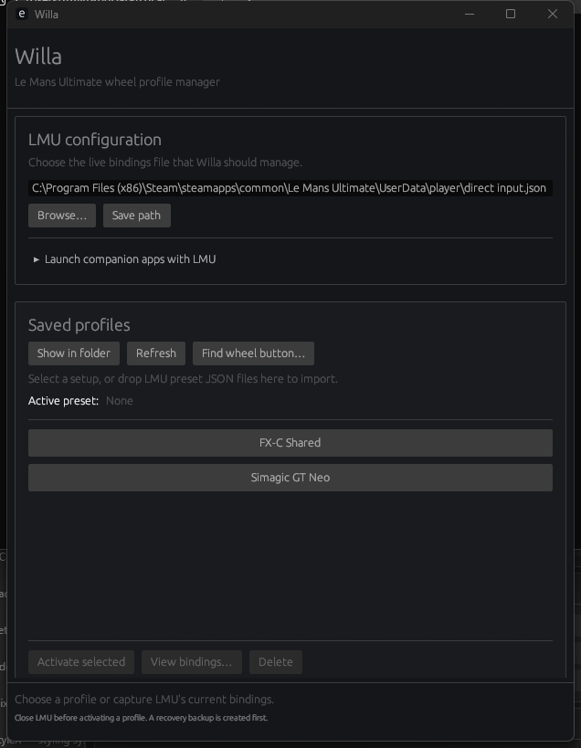

# Willa

Willa is a native Windows profile manager for Le Mans Ultimate wheel bindings. It makes it practical to use different wheel rims, cars, or classes without rebuilding the same control layout each time.



## Features

- Capture LMU's current `direct input.json` as a named profile.
- Import preset JSON files or profile folders with drag and drop.
- Activate a saved profile with an automatic recovery backup.
- Detect and warn when the live bindings differ from the active profile.
- Display the active preset separately from the currently selected row.
- Browse and search every action stored in a profile.
- Press a wheel button, move a POV, or turn an axis to compare its mapping across profiles.
- Open the managed profile directory for manual backup or copying.
- Launch Willa, LMUFFB, Crew Chief, or other selected companion apps with LMU through one Steam launch option.
- Support custom LMU installations and non-default Steam libraries.

Willa stores its own profiles in the current Windows user's application-data directory. Use **Show in folder** to open the exact location.

## Using Willa

1. Close LMU before changing profiles.
2. Confirm the path to LMU's live `direct input.json`.
3. Configure the wheel in LMU and enter a name under **Capture current bindings**.
4. Select a profile and choose **Activate selected** when changing setups.

Existing preset files can be dropped directly onto the saved-profile panel. A file is named from its filename; a folder should contain `direct input.json`.

To inspect a physical control, choose **Find wheel button…** and press or move it. Willa will show the corresponding action—or **Not mapped**—for every saved profile.

### Companion apps

Expand **Launch companion apps with LMU**, choose each executable, and enable the apps you want. **Copy Steam launch option** creates a small launcher and copies the required command. Paste it into:

**Steam → Le Mans Ultimate → Properties → Launch Options**

The launcher avoids opening duplicate Willa or companion-app processes.

## Development

The repository uses [mise](https://mise.jdx.dev/) to pin Rust and provide consistent tasks. Development from WSL cross-compiles the Windows application and launches the resulting executable through WSL interoperability.

```sh
mise trust
mise install
mise run dev
```

Useful tasks:

| Command | Purpose |
| --- | --- |
| `mise run dev` | Build and launch a Windows debug executable from WSL |
| `mise run build` | Build an optimized Windows executable |
| `mise run test` | Run native unit tests |
| `mise run check` | Type-check the native project |
| `mise run fmt` | Check Rust formatting |
| `mise run lint` | Run Clippy with warnings denied |

Release output is written to:

```text
target/x86_64-pc-windows-msvc/release/willa.exe
```

Before committing a change, run:

```sh
cargo fmt --check
cargo test
cargo clippy --all-targets --all-features -- -D warnings
cargo check --target x86_64-pc-windows-msvc
```

## AI-assisted development

Willa is developed with LLM assistance. Generated code and documentation are treated like any other contribution: changes should be scoped, reviewed, tested on both the native and Windows targets, and committed in small units with descriptive messages.

Repository-specific guidance for future human and LLM contributors is in [AGENTS.md](AGENTS.md).

## Planned work

Automatic car- or class-based selection is the next major direction. LMU exposes player vehicle and class information through its built-in Windows shared-memory interface, but the safe timing and reload behavior for applying control files while LMU is running still needs to be validated.

## License

MIT
