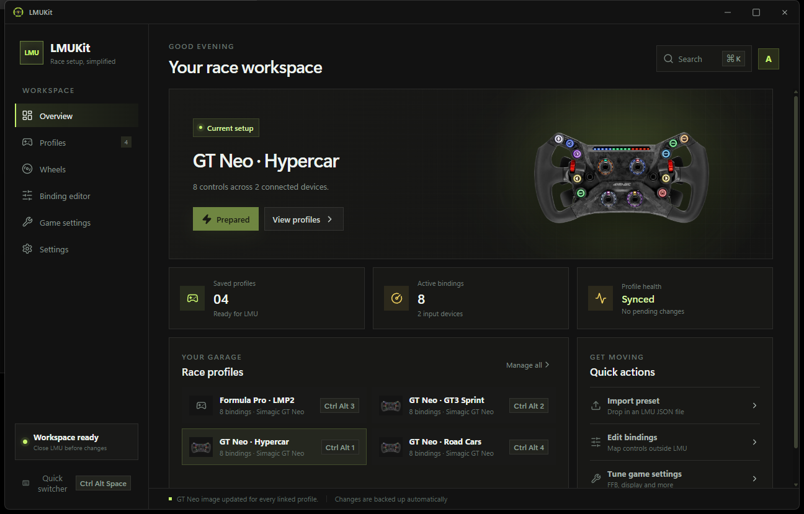

> [!WARNING]
> **Extensive AI usage disclosure:** LMUKit is developed with extensive large-language-model assistance across product design, implementation, testing, documentation, and maintenance. The project is human-directed and changes are reviewed and tested before commit, but users should evaluate the software and its source with that development process in mind.

# LMUKit

LMUKit is a modern Windows toolkit for Le Mans Ultimate. It brings binding profiles, reusable wheel metadata, control inspection, game settings, and companion-app launching into one focused race workspace.




_The screenshot uses isolated synthetic profile data; no personal LMU files are included in the repository._

## Current features

- Capture LMU's live `direct input.json` as a named profile.
- Import validated preset JSON files by file picker or drag and drop.
- Activate a saved profile for LMU's next launch, always backing up the live file first.
- Detect when LMU's live bindings differ from the active saved profile and safely update either side.
- Organise profiles in a searchable two-pane workspace using reusable wheels, built-in WEC/ELMS class tags, and custom tags.
- Create a shared wheel library with brand, model, and managed PNG, JPEG, or WebP images. One wheel can be reused by several profiles.
- Browse bindings by device, add new LMU actions, replace primary/alternate mappings, clear unwanted mappings, and press or move a physical control to compare its mapping across every profile.
- Tune recognised force-feedback fields by device—including a friendly `0..100%` FFB gain control—and inspect the complete preserved profile JSON.
- Remove obsolete devices and all of their bindings from a saved profile after confirmation.
- Browse and edit LMU's `Settings.JSON`, including descriptions from matching `Option#` fields, while preserving unsupported JSON values.
- Assign `Ctrl+Alt+1` through `Ctrl+Alt+9` to profiles, open the compact switcher with `Ctrl+Alt+Space`, or search profiles with `Ctrl+K`.
- Configure Desktop or native OpenXR (`+XR`) launching and start LMUKit, LMUFFB, Crew Chief, RaceLab, or custom companion applications through one explicit Steam launch option.
- Autosave LMU paths, launch mode, and companion-app setup.
- Scale the entire interface from Settings.

LMUKit stores profiles, managed wheel images, settings, and timestamped recovery backups in the current Windows user's application-data directory. Use the **Folder** button on Profiles to open the exact location.

## Using LMUKit

### Profiles

1. Close LMU before replacing its bindings.
2. Open **Settings** and confirm the paths to `direct input.json` and `Settings.JSON`.
3. Configure your controls in LMU, enter a profile name on **Profiles**, and choose **Capture LMU**.
4. Assign a reusable wheel and any relevant classes or tags in the selected profile's setup panel.
5. Choose **Use profile** to prepare those bindings for the next LMU launch.

LMU does not hot-reload `direct input.json`. LMUKit therefore prepares the selected profile for the next launch; it does not claim to switch bindings inside a running session.

Existing presets can be dropped anywhere on the Profiles workspace. Imported JSON is validated before LMUKit stores or activates it.

### Wheels and categories

Use **Wheels** to create reusable hardware entries, edit their brand and name, and add or replace their image. Profiles linked to that wheel share the same metadata and image throughout the app.

Each profile has one searchable tag picker. Select any combination of `GT3`, `GTE`, `LMP3`, `LMP2`, and `HY`, or type a custom tag. Leaving the class selection empty makes the profile generic.

### Profile editor

The **Profile editor** provides device-grouped binding management, force-feedback tuning, a read-only JSON preview, and live control lookup. Open a binding's action menu to replace it or add its missing primary or alternate mapping, then press or move the desired control. **Add binding** can search action names found across your saved and live LMU files or accept an exact LMU action name. LMUKit names any conflicts before applying the change and creates a recovery backup when saving.

**Find a wheel control** waits for a button, POV, or axis movement and then shows the matching action for each saved profile; the operation can be cancelled at any time. For safety, assignment only accepts devices already represented in that profile.

The force-feedback section discovers recognised numeric and boolean fields without inventing missing settings. Changes remain local until explicitly saved, and **Save & use profile** also prepares the edited profile for LMU's next launch. The JSON preview makes preserved device-specific and unknown fields auditable.

### Faster profile access

Open **Settings → Profile keyboard shortcuts** to assign `Ctrl+Alt+1` through `Ctrl+Alt+9`. Assignments are unique, so reusing a number moves it to the newly selected profile.

Press `Ctrl+Alt+Space` anywhere in Windows to open the compact profile switcher. These shortcuts still prepare a profile for LMU's next launch; they do not alter a running LMU session.

### Game settings

Open **Game settings** to search and edit LMU's `UserData/player/Settings.JSON`. Boolean, numeric, string, and nested values are supported, while matching `Option#` fields are shown as descriptions rather than duplicate settings.

Saving preserves unknown JSON data and creates a recovery backup first. Close LMU before saving because the game may overwrite its settings while running.

### LMU and companion apps

Open **Settings → LMU and companion apps**, choose **Desktop** or **VR (OpenXR)**, then add and enable the helpers you want. Paths, launch mode, and companion-app changes save automatically.

**Copy Steam launch option** creates LMUKit's launcher and copies the command. Paste it into:

**Steam → Le Mans Ultimate → Properties → Launch Options**

VR mode passes LMU's native `+XR` argument. The launcher avoids opening duplicate LMUKit or companion-app processes. LMUKit never edits Steam configuration silently.

## Development

The primary runtime is Windows, while development commonly happens in WSL. The desktop shell uses Tauri 2, the interface uses React and TypeScript, and compatibility-sensitive storage behavior lives in the independent `lmukit-core` Rust crate.

The repository uses [mise](https://mise.jdx.dev/) to pin Rust, Node.js, pnpm, and the supported commands:

```sh
mise trust
mise install
pnpm install
mise run dev
```

| Command          | Purpose                                                  |
| ---------------- | -------------------------------------------------------- |
| `mise run dev`   | Cross-build and launch the Windows debug app from WSL    |
| `mise run build` | Build the frontend and Windows x86-64 release executable |
| `mise run test`  | Run `lmukit-core` tests                                  |
| `mise run check` | Check `lmukit-core`                                      |
| `mise run fmt`   | Check Rust formatting                                    |
| `mise run lint`  | Run Clippy with warnings denied                          |
| `pnpm build`     | Type-check and build the React interface                 |

Use `LMUKIT_DATA_DIR` with an isolated directory for screenshots and manual tests. Never test development builds against personal profiles or live Windows application data.

Before handing off a code change, run:

```sh
cargo fmt --all --check
cargo test -p lmukit-core
cargo clippy -p lmukit-core --all-targets --all-features -- -D warnings
pnpm build
cargo xwin check -p lmukit --target x86_64-pc-windows-msvc
```

Repository architecture, data-format invariants, and guidance for human and AI-assisted contributors are maintained in [AGENTS.md](AGENTS.md).

## Releases

Pushing a tag matching `v*` runs the Windows release workflow. The tag version must match the Cargo and Tauri package versions. After all formatting, test, lint, frontend, and Windows build checks pass, GitHub Actions creates a release containing:

- a portable Windows x86-64 ZIP;
- the Tauri NSIS installer;
- SHA-256 checksum files for both packages.

```sh
git tag v0.3.2
git push origin v0.3.2
```

## AI-assisted development

Large language models are used extensively in LMUKit's development—not merely for occasional completion. They assist with architecture exploration, UI and product iteration, Rust and TypeScript implementation, test creation, debugging, documentation, and repository maintenance.

The human maintainer directs the product, reviews changes, runs the required checks, and decides what is committed and released. Even with that review, AI-assisted work can contain mistakes or incorrect assumptions. Issues and code review are welcome, and the repository history is intentionally kept in small, descriptive commits to make the work auditable.

## Planned work

- Read LMU's `Local\\LMUSharedMem` data to identify the active vehicle and class, while respecting that LMU does not hot-reload binding profiles.

## License

MIT
